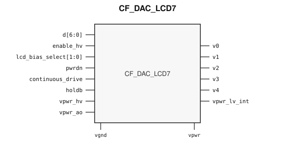

# CF_DAC_LCD7

> 7-bit LCD bias DAC

The public GDS is an abstract; ChipFoundry
substitutes protected full geometry at tapeout.

This package ships an SRAM-style PG wrap `CF_DAC_LCD7` around analog leaf
`CF_DAC_LCD7_core`.

## Overview

`CF_DAC_LCD7` is a SkyWater 130 nm hard-macro 7-bit LCD bias DAC. Instantiate `CF_DAC_LCD7`.

Macro size is 525 × 118.055 µm (15 µm halo around analog leaf 495 × 88.055 µm).
Customer PG for chip PDN is `vpwr` / `vgnd`. High-voltage supply `vpwr_hv` and
analog supply `vpwr_ao` stay wrap ports and are routed as signals. `vpwr_lv_int`
is a switched low-voltage output.

## Installation

```bash
pip install cf-ipm
ipm install CF_DAC_LCD7 --version 0.2.0
```

Use `hdl/gl/CF_DAC_LCD7.v` as the customer blackbox, `layout/lef/CF_DAC_LCD7.lef`
for P&R, and `layout/gds/CF_DAC_LCD7.gds` / `layout/mag/CF_DAC_LCD7.mag` for the
public wrap. `CF_DAC_LCD7_core` is the analog leaf (empty Verilog, pin-only
abstract). ChipFoundry substitutes vault GDS into `CF_DAC_LCD7_core` at tapeout.
P&R uses the wrap LEF (`vpwr` / `vgnd` for chip PDN).

Functional sim compiles `verify/beh_model/CF_DAC_LCD7_core.v` **instead of** the empty `hdl/gl/CF_DAC_LCD7_core.v` stub. See `verify/beh_model/README.md`.

## Features

- Code input `d[6:0]`
- Bias outputs `v0`, `v1`, `v2`, `v3`, and `v4`
- Bias select `lcd_bias_select`
- Enable `enable_hv`, power-down `pwrdn`, hold `holdb`, and `continuous_drive`
- Switched low-voltage output `vpwr_lv_int`
- High-voltage supply `vpwr_hv` and analog supply `vpwr_ao`
- Ideal Verilog behavioral model under `verify/beh_model/` for functional sim
- Customer cell `CF_DAC_LCD7` 525 × 118.055 µm (15 µm halo around analog leaf 495 × 88.055 µm)
- Chip PDN is `vpwr` / `vgnd`

## Pinout

Customer documentation includes a pinout of the integration cell only.
Internal schematics and architecture block diagrams are not published.



Pin names and directions match the public wrap (`layout/lef/CF_DAC_LCD7.lef`)
and the blackbox stub (`hdl/gl/CF_DAC_LCD7.v`).

## Pin Description

Directions and widths are taken from the shipped Verilog in `hdl/gl/CF_DAC_LCD7.v`.

| Name | Direction | Width | Description |
|---|---|---:|---|
| `v0` | output | 1 | Bias output. Follows `d[0]` in the ideal model when enabled. |
| `v1` | output | 1 | Bias output. Follows `d[1]` in the ideal model when enabled. |
| `v2` | output | 1 | Bias output. Follows `d[2]` in the ideal model when enabled. |
| `v3` | output | 1 | Bias output. Follows `d[3]` in the ideal model when enabled. |
| `v4` | output | 1 | Bias output. Follows `d[4]` in the ideal model when enabled. |
| `vpwr_lv_int` | output | 1 | Switched low-voltage supply. Follows `vpwr` while `pwrdn` is low; high-Z when `pwrdn` is high. |
| `d` | input | 7 | Code. `d[6]` is unused. `d[5]` is not modeled. |
| `enable_hv` | input | 1 | Enable. Low clears `v4`..`v0` in the ideal model. |
| `lcd_bias_select` | input | 2 | Bias-ratio select. Not modeled. |
| `pwrdn` | input | 1 | Power-down. High clears the bias outputs and releases `vpwr_lv_int`. |
| `continuous_drive` | input | 1 | Continuous-drive control. Not modeled. |
| `holdb` | input | 1 | Hold. Not modeled. |
| `vgnd` | input | 1 | Ground. The core `vnb` pin is tied to this net inside the wrap. |
| `vpwr_hv` | input | 1 | High-voltage supply. Route as a signal; not on chip PDN. The core `vpb_hv` pin is tied to this net inside the wrap. |
| `vpwr` | input | 1 | Digital supply. Tied to the core `vpwr_lv` and `vpb_lv` pins inside the wrap. |
| `vpwr_ao` | input | 1 | Analog output supply. Route as a signal; not on chip PDN. |

This macro generates LCD bias levels. It does not include a segment controller.
`d[6]` has no connection inside the leaf.

In OpenLane / LibreLane, hook chip PDN with
`PDN_MACRO_CONNECTIONS: "u_cf_dac_lcd7 vccd1 vssd1 vpwr vgnd"` and connect
`.vpwr(vccd1)`, `.vgnd(vssd1)` under `USE_POWER_PINS`. Route `vpwr_hv`,
`vpwr_ao`, `vpwr_lv_int`, and `v0`..`v4` onto `analog_io`.

```json
"SYNTH_ELABORATE_ONLY": true,
"SYNTH_USE_PG_PINS_DEFINES": "USE_POWER_PINS",
"FP_PDN_ENABLE_RAILS": false,
"RUN_TAP_ENDCAP_INSERTION": false,
"FP_PDN_HORIZONTAL_HALO": 10,
"FP_PDN_VERTICAL_HALO": 10,
"PDN_MACRO_CONNECTIONS": ["u_cf_dac_lcd7 vccd1 vssd1 vpwr vgnd"],
"MAGIC_EXT_USE_GDS": false,
"MAGIC_EXT_ABSTRACT_CELLS": ["^CF_DAC_LCD7_core$"],
"PRIMARY_GDSII_STREAMOUT_TOOL": "magic",
"MAGIC_MACRO_STD_CELL_SOURCE": "macro",
"MAGIC_CAPTURE_ERRORS": false,
"RUN_MAGIC_DRC": false
```

## Specifications

This macro is the catalog 7-bit LCD bias DAC. No Liberty timing file ships
with this package. This README does not invent PVT tables. The ideal model
copies `d[4:0]` onto `v4`..`v0` when enabled. It does not implement bias ratios.

## Timing Diagram

The ideal model in `verify/beh_model/` is the functional timing reference for
simulation. `pwrdn` high clears `v4`..`v0` and releases `vpwr_lv_int`. With
`enable_hv` high and `pwrdn` low, `v4`..`v0` follow `d[4:0]` and `vpwr_lv_int`
follows `vpwr`. That model is not silicon-verified.

## Limitations and Open Issues

- Verilog in `hdl/gl/CF_DAC_LCD7.v` is a structural wrap around an empty
  `CF_DAC_LCD7_core` blackbox. Functional sim uses `verify/beh_model/CF_DAC_LCD7_core.v` (ideal model, not SPICE).
- Liberty is not in this package. P&R uses the wrap LEF.
- Bias ratios, hold, continuous drive, and `d[6:5]` are not modeled. There is no segment controller.

## Release History

| Version | Date | Notes |
|---|---|---|
| 0.2.0 | 2026-09-29 | First SRAM-style PG-wrapped package. Ideal behavioral model. Core fill-exclude covers. |

## Tapeout History

This hard macro has high-volume commercial production history (millions of
units). Catalog and IPM maturity is Production. ChipFoundry substitutes
protected full layout at tapeout. The chipIgnite delivery of this package is
not marked shuttle-proven until a run returns.
